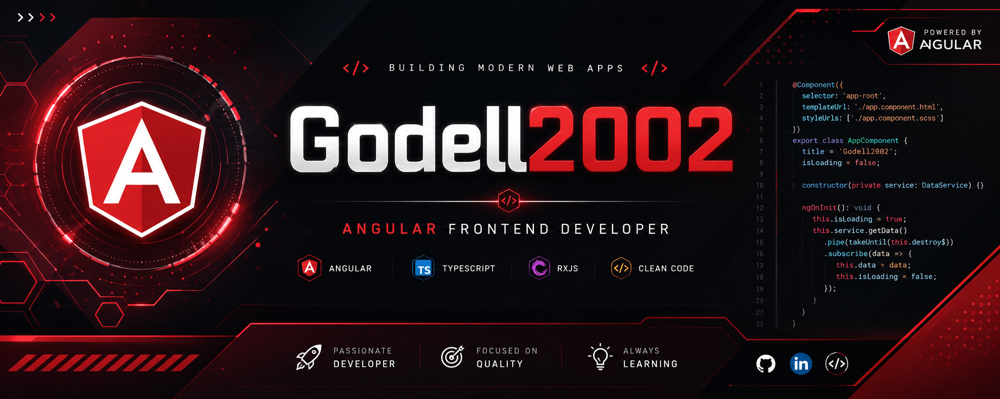

<p align="center">
  
</p>

<h1 align="center">
Hi 👋 I'm Gadel
</h1>

<h3 align="center">
Angular Frontend Developer from Russia RU
</h3>

<p align="center">

</p>

---

# 👨‍💻 About Me

💻 Frontend Developer passionate about building modern web applications.

🌱 Currently learning advanced Angular architecture, RxJS and performance optimization.

🎯 Goal: Angular Developer.

---

# 🚀 Tech Stack

### Frontend

<p align="left">


</p>

### Tools

<p align="left">


</p>

### Currently Learning

<p align="left">


</p>

---

# 📈 GitHub Stats

<p align="center">


</p>

---

# 🔥 GitHub Streak

<p align="center">


</p>

---

# 🏆 GitHub Trophies

<p align="center">


</p>

---

# 📚 What I'm Learning

- Angular
- TypeScript
- RxJS
- Signals
- SCSS
- REST API
- Responsive Design
- Clean Architecture
- Git Workflow

---

# ⚡ Development Workflow

```text
      🎨 Design
          │
          ▼
       Figma
          │
          ▼
    HTML + SCSS
          │
          ▼
       Angular
          │
          ▼
     TypeScript
          │
          ▼
      REST API
          │
          ▼
      Deployment
```

---

# 💼 Skills

✅ Angular

✅ TypeScript

✅ JavaScript

✅ HTML5

✅ CSS3

✅ SCSS

✅ Bootstrap

✅ Tailwind CSS

✅ RxJS

✅ REST API

✅ Git

✅ GitHub

✅ Figma

---

# 📫 Connect with Me

<p align="left">

<a href="https://github.com/Gadel2002">

</a>

</p>

---

<p align="center">


</p>

<p align="center">


</p>

---

<p align="center">


</p>

---

<h2 align="center">
⭐ Thank you for visiting my profile ⭐
</h2>
 


